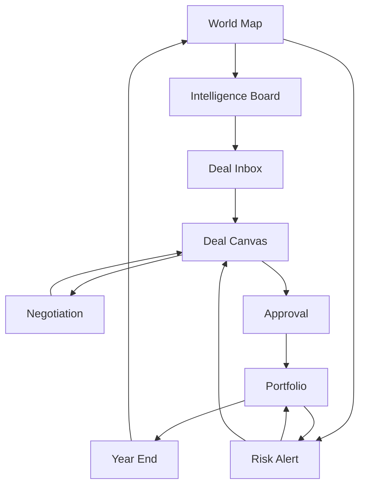
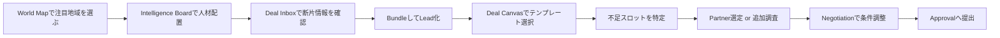
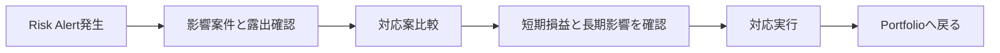

# 総合商社シミュレーション UIワイヤーと画面遷移

## 1. UI/UXの前提
- プレイ感は「複雑」ではなく「多面的」にする
- 1画面1役割を徹底し、同時に悩む論点を絞る
- 常に `世界情勢` `案件状況` `社内外の温度感` の3つが追えるようにする
- Desktop first で設計し、狭い画面では右サイド情報を下部タブへ退避する

## 2. MVPで必須の画面
- `World Map`
- `Intelligence Board`
- `Deal Inbox`
- `Deal Canvas`
- `Negotiation`
- `Approval`
- `Portfolio`
- `Risk Alert`
- `Year End`

## 3. 共通UI

### 3-1. Global HUD
全画面の上部に固定。

表示項目:
- Turn / Year
- Current Phase
- Cash
- Investment Capacity
- HQ Reputation
- Regional Trust
- ESG Score
- Alerts

### 3-2. Right Context Rail
全画面右側に出す補助エリア。

表示候補:
- 現在選択中案件の要約
- 未処理アラート
- 次にやるべき行動
- 影響を受ける主要指標

### 3-3. カラー/視覚ルール
- Opportunity: teal
- Risk: amber / red
- HQ / internal: navy
- Government / public: green
- Finance: gold
- Locked / missing: gray

## 4. 画面遷移の全体像



## 5. 画面ごとの詳細

### 5-1. World Map

#### 役割
- その年の世界の変化を読む入口
- どこを見るかを決める戦略ハブ

#### 主な表示
- 地域カード
  - 日本
  - 東南アジア
  - 中東
- 地域ごとの `Opportunity Score` `Risk Score`
- ニュースティッカー
- 資源価格 / 為替ミニチャート
- 保有アセットの配置

#### 主要操作
- 地域選択
- レイヤー切替
  - Opportunities
  - Risks
  - Assets
  - Network
- `Start Intelligence Phase`

#### ワイヤー

```text
+----------------------------------------------------------------------------------+
| Turn 3 / 2028 | Phase: Market Update | Cash 120 | Invest 60 | HQ 8 | ESG 54     |
+----------------------------------------------------------------------------------+
| Layers: [Opportunity] [Risk] [Assets] [Network]          Alerts: 2              |
+-----------------------------------------+----------------------------------------+
| WORLD MAP                               | CONTEXT RAIL                           |
|                                         | - Key News                             |
|   [Japan] Score O:42 R:18               | - FX: JPY weak                         |
|                                         | - LNG price up                         |
|   [SEA]   Score O:78 R:47               | - ESG concern in port project          |
|                                         |                                        |
|   [Middle East] Score O:61 R:52         | Recommended focus: SEA Energy          |
|                                         |                                        |
+-----------------------------------------+----------------------------------------+
| Bottom News: Vietnam demand surge / Port congestion / Green subsidy program      |
+----------------------------------------------------------------------------------+
```

#### UXメモ
- 初見プレイヤーはまずここで「今年どこが熱いか」を直感で理解する
- 詳細の数字より、注目地域を選びたくなる視認性を優先

### 5-2. Intelligence Board

#### 役割
- どこに人材を張るか決める
- 広く拾うか、狭く深掘るかを判断する

#### 主な表示
- 地域 x 産業マトリクス
- 配置可能人材
- 情報源候補
- 期待できる断片タグ

#### 主要操作
- 人材ドラッグ配置
- `Deep Dive` / `Broad Scan` 切替
- 重点テーマ設定

#### ワイヤー

```text
+----------------------------------------------------------------------------------+
| Intelligence Board                                                               |
+-------------------------------+-------------------------------+------------------+
| STAFF POOL                    | REGION x INDUSTRY GRID        | EXPECTED OUTPUT  |
| Originator x2                 |          Energy Food Infra    | - need tag +2    |
| BizDev x2                     | Japan     [ ]    [ ]  [ ]     | - finance tag +1 |
| Finance x1                    | SEA       [2]    [1]  [ ]     | - govt source    |
| Gov x1                        | MidEast   [ ]    [ ]  [ ]     |                  |
+-------------------------------+-------------------------------+------------------+
| Sources: [Government] [Bank] [Manufacturer] [Local Conglomerate] [Trade Media]  |
| Mode: (Deep Dive) (Broad Scan)                                                   |
+----------------------------------------------------------------------------------+
```

#### UXメモ
- 1回の配置変更で期待結果がすぐ更新されるようにする
- ここでは正解を隠しすぎない

### 5-3. Deal Inbox

#### 役割
- 断片情報を整理し、案件リード候補に変える

#### 主な表示
- 断片情報カード一覧
- フィルタ
- タグクラウド
- 自動検出されたリード候補

#### 主要操作
- カードを pin する
- 複数カードを束ねて `Create Lead`
- リード候補からテンプレート比較

#### ワイヤー

```text
+----------------------------------------------------------------------------------+
| Deal Inbox                                                                       |
+-----------------------------------------+----------------------------------------+
| FRAGMENTS                               | LEAD CANDIDATES                        |
| [Gov] VN power demand rising            | 1. LNG to Power - SEA South Coast      |
| tags: need power demand_growth          |    score 61 / missing logistics        |
| certainty 3 expires 2                   |                                        |
|                                         | 2. Port Logistics Upgrade              |
| [Bank] SG bank seeks infra lending      |    score 58 / missing anchor tenant    |
| tags: finance infra_debt                |                                        |
| certainty 2 expires 3                   |                                        |
|                                         | 3. Grid Upgrade PPP                    |
| [Trade] Port congestion worsening       |    score 54 / missing local partner    |
| tags: risk logistics bottleneck         |                                        |
+-----------------------------------------+----------------------------------------+
| Filter: [SEA] [Energy] [Government] [High Certainty]                             |
| Actions: [Pin] [Bundle] [Create Lead] [Send to Canvas]                           |
+----------------------------------------------------------------------------------+
```

#### UXメモ
- 断片の「不足条件への変換」が分かるようにする
- 同じ情報がリスクにも機会にもなる見え方が重要

### 5-4. Deal Canvas

#### 役割
- ゲームの主戦場
- 不成立な仮説を、成立する案件へ変える

#### 主な表示
- 中央に案件テンプレート
- 周囲に必須スロット
- 左に断片情報
- 右にパートナー候補
- 下に財務、リスク、承認難易度、シナジー予測

#### 主要操作
- スロットへの drag and drop
- 出資比率調整
- 契約条項選択
- 別案比較保存

#### ワイヤー

```text
+----------------------------------------------------------------------------------+
| Deal Canvas: LNG to Power                                                        |
+-------------------------+-----------------------------------+--------------------+
| FRAGMENTS               | CANVAS                            | PARTNERS           |
| need: VN power growth   |        [Demand      OK]           | JP Transformer Co  |
| finance: SG bank        | [Tech  OK]   [Permit OK]          | SG Project Bank    |
| risk: weak port         | [Local Partner MISSING]           | VN State Utility   |
| access: subsidy         | [Finance OK] [Logistics MISSING]  | Local Conglomerate |
|                         | [Offtake OK] [Operator MISSING]   | Port Operator      |
+-------------------------+-----------------------------------+--------------------+
| Equity 45 | Debt 135 | IRR 13.2% | Approval 72 | Risk 18 | Synergy +2          |
| Missing: Local Partner / Logistics / Operator                                     |
| Actions: [Compare Plan B] [Open Negotiation] [Submit for Approval disabled]       |
+----------------------------------------------------------------------------------+
```

#### UXメモ
- スロットが埋まるたびに「成立に近づく手応え」を見せる
- どこが足りないか、何を足すとどう変わるかを即時反映する

### 5-5. Negotiation

#### 役割
- 相手の本音を読み、通る条件に調整する

#### 主な表示
- 相手プロフィール
- 公開要求
- 推測ニーズ
- 関係値
- 提案パネル
- 交渉ログ

#### 主要操作
- 議題選択
- 提案2件選択
- 譲歩1件選択
- `Send Offer`

#### ワイヤー

```text
+----------------------------------------------------------------------------------+
| Negotiation: Local Conglomerate                                                  |
+--------------------------------+-----------------------------------------------+
| PARTNER PROFILE                | OFFER BUILDER                                 |
| Type: Conglomerate             | Topic: [Equity Split v]                       |
| Trust: 42                      | Offer A: [Minority protection]                |
| Public stance: keep control    | Offer B: [Guaranteed dividend floor]          |
| Hidden hints: values prestige  | Concession: [Board seat]                      |
| BATNA: medium                  |                                               |
+--------------------------------+-----------------------------------------------+
| Acceptance Preview: 68 | Risks: HQ dislikes control loss                        |
| Log: "They are open to funding support, but resist management loss."             |
| Actions: [Send Offer] [Switch Topic] [Walk Away]                                 |
+----------------------------------------------------------------------------------+
```

#### UXメモ
- 受諾率だけでなく、何に反応しているかを文字で返す
- ミニゲーム化しすぎず、構造調整の一部として扱う

### 5-6. Approval

#### 役割
- 社内関係者との調整
- 良案件でも通らない壁を見せる

#### 主な表示
- 部門別評価
- veto 警告
- 指摘事項
- 再提出のための改善案

#### 主要操作
- 根回し先の選択
- 追加措置の実行
- 稟議提出

#### ワイヤー

```text
+----------------------------------------------------------------------------------+
| Approval: LNG to Power                                                           |
+-----------------------------------------+----------------------------------------+
| DEPARTMENT SCORES                       | ISSUE BOARD                            |
| Finance        74                       | Finance: long payback                  |
| Risk Mgmt      58 !                     | Risk: logistics concentration          |
| Legal          81                       | ESG: transition fuel explanation weak  |
| ESG            49 !!                    |                                        |
| Management     69                       | Suggested fixes:                       |
| Business Unit  88                       | - add logistics backup                 |
|                                         | - add emissions mitigation             |
+-----------------------------------------+----------------------------------------+
| Actions: [Pre-wire ESG] [Add hedge] [Revise terms] [Submit]                      |
+----------------------------------------------------------------------------------+
```

#### UXメモ
- 否決は理不尽に見せず、「何を変えれば通るか」が見えることが大事

### 5-7. Portfolio

#### 役割
- 個別案件を超えて全社最適を見る

#### 主な表示
- 保有案件一覧
- 地域/産業構成
- リスク集中
- シナジー接続グラフ
- 次年度CF予測

#### 主要操作
- 売却
- 追加投資
- 優先監視設定

#### ワイヤー

```text
+----------------------------------------------------------------------------------+
| Portfolio                                                                         |
+--------------------------------------+-------------------------------------------+
| ACTIVE DEALS                         | SYNERGY GRAPH                             |
| 1. LNG to Power (construction)       | LNG --> Power --> Grid                    |
| 2. Port Upgrade (operating)          | Port --> Logistics --> Food chain         |
| 3. Grain Cold Chain (operating)      |                                           |
+--------------------------------------+-------------------------------------------+
| Region Mix: SEA 68 / Japan 20 / ME 12 | Risk Concentration: SEA + Energy high    |
| Next Year CF: 42                      | Corporate Value Score: 188               |
| Actions: [Divest] [Expand] [Set Risk Watch]                                       |
+----------------------------------------------------------------------------------+
```

#### UXメモ
- シナジーは表ではなく線で見せる
- 単独利益の高い案件より、構造価値のある配置を選びたくなる見せ方にする

### 5-8. Risk Alert

#### 役割
- 事故や政変などの突発イベントへの対応画面

#### 主な表示
- 事件概要
- 影響範囲
- 3-4つの対策
- 短期損益と長期影響

#### 主要操作
- 対応策比較
- 即時実行
- 後回し

#### ワイヤー

```text
+----------------------------------------------------------------------------------+
| Risk Alert: Export Restriction Tightened                                          |
+------------------------------------------+---------------------------------------+
| Impacted Deals                           | RESPONSE OPTIONS                      |
| - LNG to Power                           | A. Rebuild contract                    |
| - Grid Upgrade                           |    - cash 8                            |
|                                          |    - delay 1 turn                      |
| Severity: High                           |    - preserve partner trust            |
| Exposure: logistics / regulation         |                                       |
|                                          | B. Switch supplier                     |
|                                          |    - cash 15                           |
|                                          |    - lower margin                      |
|                                          |    - unlock local assembly path        |
+------------------------------------------+---------------------------------------+
| Actions: [Execute A] [Execute B] [Take Loss]                                      |
+----------------------------------------------------------------------------------+
```

#### UXメモ
- リスクは必ず「再設計の余地」とセットで提示する

### 5-9. Year End

#### 役割
- 年度結果を振り返り、次年の戦略テーマを決める

#### 主な表示
- 売上、営業CF、投資残高
- 社内評価、現地信頼、ESG
- 今年の成功・失敗トピック
- 次年ブースト選択

#### 主要操作
- 次年重点テーマの選択
- 年度レポートの確認
- 次ターンへ進む

#### ワイヤー

```text
+----------------------------------------------------------------------------------+
| Year End 2028                                                                     |
+-----------------------------------------+----------------------------------------+
| P/L and CF                             | Strategic Review                        |
| Revenue: 86                            | Best move: port + food chain synergy    |
| Operating CF: 18                       | Main weakness: ESG credibility          |
| Equity Invested: 45                    | Missed chance: ME financing window      |
| HQ Reputation: +4                      |                                        |
+-----------------------------------------+----------------------------------------+
| Choose next-year focus: [Network] [Capital Efficiency] [ESG Recovery]            |
| Action: [Advance to 2029]                                                        |
+----------------------------------------------------------------------------------+
```

## 6. 主要ユーザーフロー

### 6-1. 案件組成の基本フロー



### 6-2. 危機対応フロー



## 7. MVPの画面実装順

1. `World Map`
2. `Intelligence Board`
3. `Deal Inbox`
4. `Deal Canvas`
5. `Negotiation`
6. `Approval`
7. `Year End`
8. `Portfolio`
9. `Risk Alert`

理由:
- 最初に遊ばせたいのは `Deal Canvas` だが、その前に「なぜこの案件なのか」を体験させる入口が必要
- `Portfolio` は魅力的だが、1件も成立していない段階では価値が薄い
- `Risk Alert` は後から入れても成立するため後順位でよい

## 8. UX上の注意点
- 数値は多いが、一度に見せる判断軸は3つまでにする
- 断片情報、パートナー、部門意見はすべてタグでつなぐ
- 画面遷移より、右レール更新やモーダルでテンポを保つ
- 初回プレイでは `なぜこの案件が開いたか` を常に明示する
- 交渉と稟議は別画面だが、同じ案件条件を見ながら進められるようにする

## 9. 最初に作るべき簡易UI構成
6ターンの試作版では以下の5画面に絞ってよい。

- `World Map`
- `Intelligence Board`
- `Deal Canvas`
- `Negotiation`
- `Year End`

この簡易版では `Deal Inbox` は左パネル内包、`Approval` は簡易モーダル、`Portfolio` は `Year End` 内タブで代替してよい。
